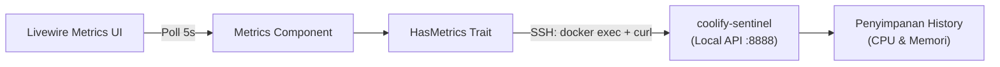
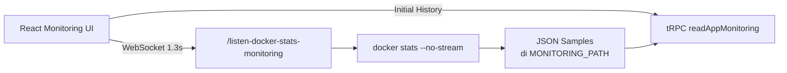
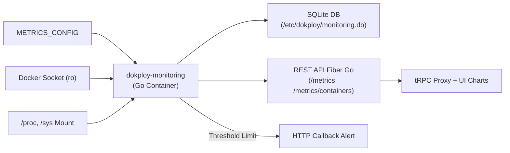

# Studi Referensi Observability: Uploy vs. Coolify vs. Dokploy

> **Audit & Inspeksi Kode Reference:** 12 Agustus 2026  
> **Lokasi Referensi Kode:**
> - `/Users/wahyusyahputra/Development/References/coolify`
> - `/Users/wahyusyahputra/Development/References/dokploy`

Dokumen ini merupakan hasil studi mendalam terhadap arsitektur observabilitas (metrik resource, log, streaming data, dan sistem penyimpanan) pada platform PaaS open-source utama: **Coolify** dan **Dokploy**, serta perbandingannya dengan kondisi **Uploy** saat ini. Studi ini disusun sebagai panduan teknis sebelum menghubungkan UI observability Uploy ke backend Go.

---

## ⚡ Ringkasan Eksekutif (TL;DR)

| Dimensi | Uploy (Saat Ini) | Coolify | Dokploy (Jalur Gratis) | Dokploy (Monitoring Agent) |
| :--- | :--- | :--- | :--- | :--- |
| **Model Arsitektur** | Mockup UI Frontend | Agent Sentinel per Server | Backend Utama + WebSocket | Container Go (`dokploy-monitoring`) per Server |
| **Penyimpanan History** | Tidak ada | Di dalam SQLite/Memory Sentinel | File sampel JSON lokal | Database SQLite (`monitoring.db`) + Retention |
| **Mekanisme Realtime** | Tidak ada | UI Polling (setiap 5 detik) | WebSocket (setiap 1,3 detik) | UI Polling ke Backend/tRPC Proxy |
| **Metrik Utama** | Hard-coded (CPU, RAM, Disk, Net) | CPU & Memori (Host & Container) | CPU, RAM, Disk, Block I/O, Net | Host + Container (CPU, RAM, Disk, Net, Process) |
| **Sistem Alerting** | Tidak ada | Terpisah (bukan via Sentinel) | Tidak ada | Callback HTTP POST saat melewati threshold |

---

## 🔍 1. Status Uploy Saat Ini

**Kesimpulan Utama: Halaman Observability Uploy saat ini murni sebatas Frontend Preview / UI Mockup.**

### Hasil Audit Kode Uploy:
- **Single Route Frontend:** Terletak di [`frontend/src/routes/(app)/(builder)/projects/[id]/observability/+page.svelte`](file:///Users/wahyusyahputra/Development/Projects/uploy/frontend/src/routes/%28app%29/%28builder%29/projects/%5Bid%5D/observability/+page.svelte).
- **Tanpa Fetch/State Engine:** Tidak ada file `+page.ts`, `+page.server.ts`, pemanggilan API, polling interval, maupun WebSocket connection pada route tersebut.
- **Data Statis:** Nilai metrik seperti CPU `38%`, nama VM `production-vm-01`, IP `203.0.113.24`, grafik SVG, serta tabel *Top Processes* adalah konstanta JavaScript statis. UI secara eksplisit memberi tanda `<Badge tone="warning">Preview data</Badge>`.
- **Fondasi Logging backend Sudah Siap:** Repo Uploy sudah memiliki handler backend untuk streaming log container/service berbasis SSH & SSE (Server-Sent Events):
  - [`api/handlers/container_logs.go`](file:///Users/wahyusyahputra/Development/Projects/uploy/api/handlers/container_logs.go) (Streaming log container via `docker logs -f --tail 200`)
  - [`api/handlers/service_logs.go`](file:///Users/wahyusyahputra/Development/Projects/uploy/api/handlers/service_logs.go)
  - [`api/handlers/server_logs.go`](file:///Users/wahyusyahputra/Development/Projects/uploy/api/handlers/server_logs.go)  
  Namun, backend pengumpul metrik resource (CPU, RAM, Disk, Network) belum tersedia dan UI observability belum terhubung ke endpoint log tersebut.

---

## 🟢 2. Bedah Arsitektur Coolify

Coolify menggunakan pendekatan **Sidecar Sentinel Agent per Host** yang dikonsumsi secara remote oleh aplikasi utama Coolify melalui koneksi SSH.

### Alur Kerja (Data Flow)



### Detail Implementasi (Inspeksi Kode Reference):
1. **Pengaktifan Sentinel Agent:**
   Ketika fitur metrik diaktifkan pada server target, Coolify menjalankan container `coolify-sentinel` di server tersebut.
2. **Transport Data via SSH & Local API (`HasMetrics.php`):**
   Aplikasi utama Coolify tidak membuka port Sentinel ke publik. Sebagai gantinya, Coolify mengeksekusi perintah SSH:
   ```bash
   docker exec coolify-sentinel sh -c 'curl -H "Authorization: Bearer <token>" http://localhost:8888/api/...'
   ```
   - Metrik Server: `/api/{cpu|memory}/history?from=<ISO-8601>`
   - Metrik Container: `/api/container/{container-uuid}/{cpu|memory}/history?from=<ISO-8601>`
3. **UI Polling & Smart Refresh (`Metrics.php` & `Charts.php`):**
   - Mendukung rentang waktu: 5 menit, 10 menit, 30 menit, 1 jam, 12 jam, 7 hari, 30 hari.
   - Jendela pendek (<= 10 menit) menggunakan polling otomatis setiap 5 detik. Jendela lebih panjang dimuat sekali saat user mengganti interval.
4. **Algoritma Downsampling (LTTB):**
   Jika data historis memiliki lebih dari **1.000 titik sampel** (pada rentang waktu > 60 menit), Coolify mengompresi data titik menggunakan algoritma **LTTB (Largest-Triangle-Three-Buckets)** untuk menjaga kinerja render grafik di browser.
5. **Batasan Coolify:**
   - Metrik yang dikumpulkan terbatas pada CPU dan RAM (tidak ada disk I/O, network throughput, atau daftar proses).
   - Metrik per-container tidak mendukung setup Docker Compose multi-container (UI menampilkan callout khusus).
   - Fitur Log bersifat terpisah dari Sentinel (log diambil via SSH menggunakan `docker logs` langsung).

---

## 🔵 3. Bedah Arsitektur Dokploy

Dokploy memiliki **dua jalur yang terpisah secara mendasar**: jalur *Free Realtime Stream* dan jalur *Paid/Agent Monitoring*.

### A. Jalur Gratis: Realtime Stream Ringan



* **Mekanisme WebSocket (`docker-stats.ts`):**
  Frontend membuka koneksi WebSocket ke `/listen-docker-stats-monitoring?appName=...&appType=...`.
* **Streaming Sampling:**
  Server backend menjalankan `setInterval` setiap **1,3 detik** yang mengeksekusi:
  ```bash
  docker stats <container-id> --no-stream --format '{"BlockIO":"{{.BlockIO}}","CPUPerc":"{{.CPUPerc}}",...}'
  ```
  *(Kasus khusus: jika appName adalah `"dokploy"`, server membaca statistik host system).*
* **Penyimpanan Lokal & Buffer Browser:**
  Hasil sampling disimpan ke file sampel JSON sederhana di folder `MONITORING_PATH`. State browser menyimpan maksimal **300 sampel terbaru** pada memory frontend.

### B. Jalur Monitoring Agent: Dedicated Go Container & Alerting



* **Setup Agent (`monitoring-setup.ts`):**
  Dokploy menginisialisasi container Go `dokploy-monitoring` di server target dengan bind mounts:
  - Docker Socket read-only: `/var/run/docker.sock:/var/run/docker.sock:ro`
  - Host System Info: `/sys:/host/sys:ro`, `/proc:/host/proc:ro`, `/etc/os-release:/etc/os-release:ro`
  - Persistence Storage: `/etc/dokploy/monitoring/monitoring.db:/app/monitoring.db`
* **Agent Go Engine (`apps/monitoring/main.go`):**
  - Menggunakan framework **Fiber Go** untuk REST API internal dengan Auth Middleware Bearer Token (`/metrics` & `/metrics/containers`).
  - Menggunakan library `gopsutil` untuk metrik host dan SDK Docker/CLI stats untuk metrik container.
  - Menyimpan data persisten ke database **SQLite** (`server_metrics` dan `container_metrics`).
* **Cron Cleanup & Notification Threshold:**
  - Menjalankan cron job pembersihan data otomatis berdasarkan `RetentionDays`.
  - Background ticker memeriksa ambang batas (*threshold*) CPU/RAM; jika terlewati, agent mengirimkan HTTP POST callback ke backend server Dokploy untuk mentrigger notifikasi.

---

## 📊 4. Matriks Perbandingan & Keputusan untuk Uploy

| Pertimbangan Arsitektur | Coolify | Dokploy Gratis | Dokploy Agent | Rekomendasi Uploy |
| :--- | :--- | :--- | :--- | :--- |
| **Metode Collector** | Sentinel Agent di tiap Server | Exec Backend Utama | Container Go Agent di Host | **SSH Command / Remote Agent ringan** per server |
| **Transport Protocol** | HTTP Polling via SSH (5s) | WebSocket (1.3s) | HTTP API Proxy (Polling) | **HTTP REST / Polling SSE** (dimulai dari polling) |
| **Penyimpanan Storage** | In-Memory / Internal | File JSON Sampel | SQLite Persistent DB | **SQLite** (jika butuh history > 1 jam) |
| **Scope Monitoring** | Server & Resource Single Container | Single App Active Container | Full Host & Filtered Containers | **Container milik Project/Service** (Scope isolation) |
| **Autentikasi** | Internal Bearer Token | User Session + Authorization | Bearer Token Config | **Project Auth + Server Key** |
| **Sistem Alert** | Terpisah | Tidak ada | Callback threshold limit | **Ditunda** sampai data telemetry stabil |

---

## 🚀 5. Rekomendasi Strategis & Roadmap Uploy

### 🎯 Prinsip Utama
> **Jangan memindahkan UI Mock host-wide VM langsung ke level Project.**  
> Di dalam Uploy, satu Virtual Machine (VM) atau server bisa menampung banyak project. Menampilkan metrik *Host-wide* (seperti total CPU/Disk VM) pada level dashboard Project akan menyesatkan pengguna. Observabilitas project harus berfokus pada **container & service yang menjadi milik project tersebut**.

---

### 🟢 Fase 1: MVP Realtime Snapshot (Rekomendasi Utama)

1. **Rapikan Frontend State:**  
   Ganti data hard-coded di `observability/+page.svelte` dengan *empty*, *loading*, dan *error state*. Pertahankan badge `Preview data` sampai API backend benar-benar terhubung.
2. **Endpoint Read-Only Container Snapshot:**  
   Buat API endpoint di Go backend yang mengambil snapshot realtime container milik project via SSH runner:
   ```bash
   docker stats --no-stream --format "{{.ID}}|{{.Name}}|{{.CPUPerc}}|{{.MemUsage}}|{{.NetIO}}|{{.BlockIO}}"
   ```
3. **Focus on Current Usage:**  
   Tampilkan kartu ringkasan penggunaan saat ini (*Current Usage*) per container. Hapus grafik tren, statistik disk host, dan daftar top process dummy sampai backend siap menyediakan data historis asli.

---

### 🟡 Fase 2: Historical Metrics & Retention (Pengembangan Lanjutan)

Jika fitur grafik riwayat 1 jam, 24 jam, hingga 7 hari benar-benar dibutuhkan:

1. **Local Collector Agent:**  
   Jalankan worker pengumpul metrik ringan di server (atau via daemon service Uploy) yang melakukan sampling setiap 15-30 detik.
2. **Skema Identitas Data yang Stabil:**  
   Simpan sampel metrik ke database lokal/SQLite dengan metadata lengkap:
   `project_id`, `service_id`, `deployment_id`, `container_id`, `timestamp_utc`, `cpu_percentage`, `memory_bytes`, `net_bytes`, `block_bytes`.
3. **Data Retention & Downsampling:**  
   - Terapkan rotasi pembersihan otomatis (misal: simpan data mentah maksimal 7 hari).
   - Terapkan teknik downsampling (seperti algoritma LTTB milik Coolify) sebelum mengirimkan titik data chart ke frontend jika rentang waktu > 24 jam.
4. **Interval API Windowed:**  
   Sediakan endpoint API dengan filter window (`?range=5m|1h|24h|7d`) yang dipanggil frontend menggunakan *smart polling* (misal: interval 5 detik untuk window 5 menit).

---

## 📌 Status Keputusan Saat Ini

Audit ini bersifat **analisis referensi dan panduan arsitektur**. Tidak ada perubahan kode pada aplikasi Uploy yang wajib dieksekusi secara instan. Dokumen ini menjadi acuan resmi sebelum tim menghubungkan route preview observability ke backend Go Uploy.
